Подготовил : Гуров Н. О.

### Общее описание.
Это утлита для создания картинок штрих-кодов с шумом. Для начала штрих коды генерируются после чего они зашумляются.
Шум реализован как дефекты принтора  и соответтвенно опирается на дефекты валика принтера и имеет механизм репликации одинакого шума с периодом задаваемым пользователем.

Так же включены механизмы создания шума зависящего от освещения взятые из библиотеки augraphy

### Пайплайн:
- Запускается генерация с задаными параметрами в generation.config
- Запускается зашумление из Distortions с параметрами заданными в noize.config
- Запускается зашумление из augraphy с паарметрами из auraphy.config
- Запускается валидация из Validate

### Примеры дефектов:

#### Блюр :

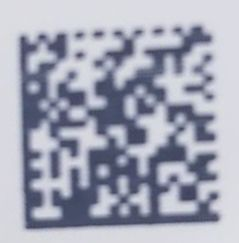
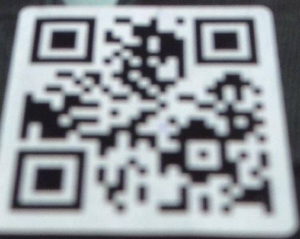

#### Лого :

#### Проблемы с печатью :

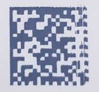
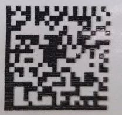

#### Проблемы с освещением :

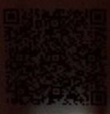

#### Грязь :

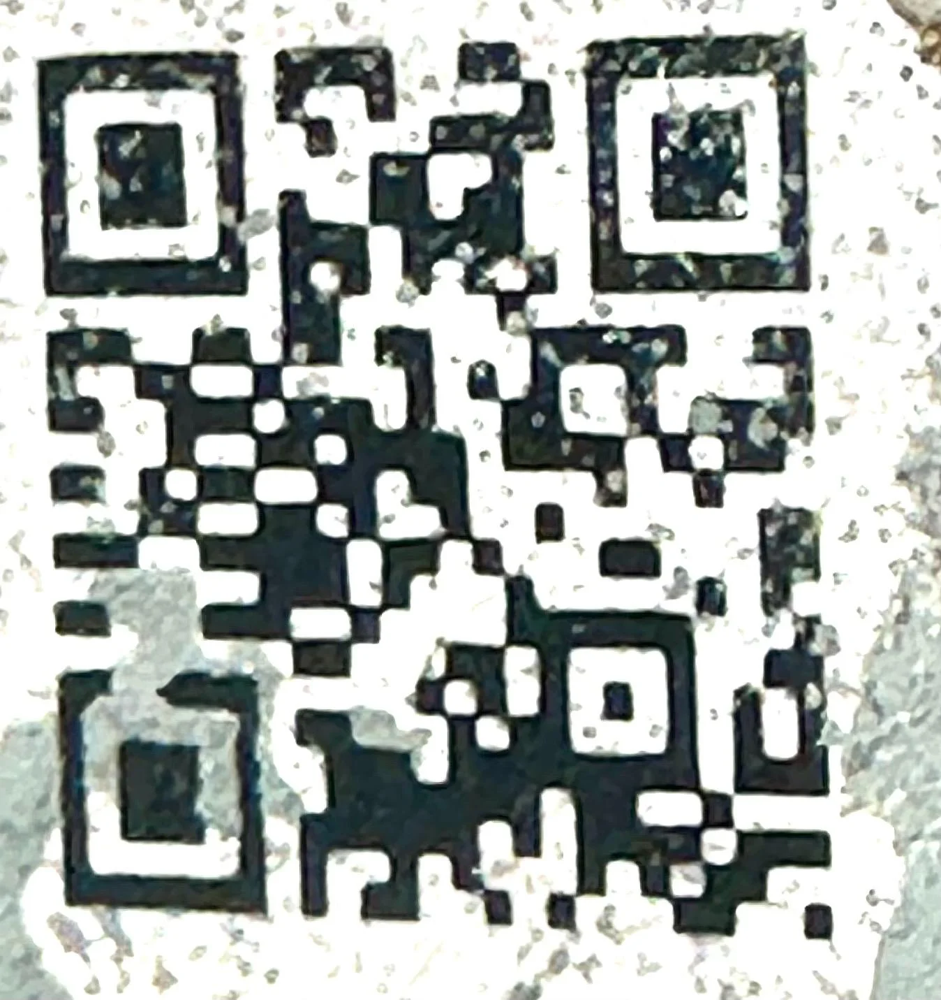

### Примеры:
Оригинальная сгенеированная картинка:
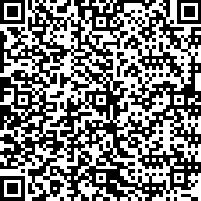

### Примеры шумов:

#### Проблемы с печатью :
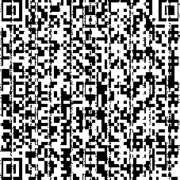
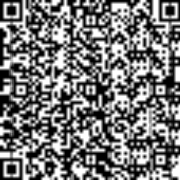

#### Лого :
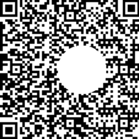
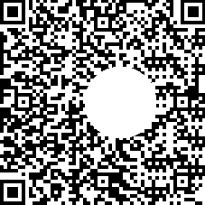

#### Грязь :

#### Проблемы со светом :
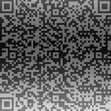
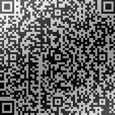

#### Комбинация :

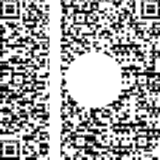

#### Информация по параметрам запуска : [git](https://github.com/Nerubes/QR-Noize/blob/master/README.md)

### Сборка и как запустить

Для компиляции нужно вызвать скрипт build.sh

Далее для генерации и преобразования картинок нужно вызывать скрипт run.sh из этой директории.

Вызов происходит из консоли со следующими параметрами :

1. Файл с описанием операций создания картинок в виде :

- Тип штрих кода:количество картинок:параметры (в виде key1=value1:key2=value2 или None) ([типы](https://pypi.org/project/treepoem/))

- Далее идет (количество картинок) строк, для создания штрих кодов

- После этого полученные картинки сохраняются в директорию по пути указанном во втором параметре

2. Папка с картинками, которые должны быть преобразованы и место созранения картинок из первого шага

3. Название папки или путь куда будут записаны все картинки после преобразования (она создает папку)

4. Файл с описанием операций и их названиями, должен быть составлен в соответствии со следующими правилами :

- Можно писать коментарии начинающиеся с / (я делал с // потому что так лучше видно)

- Описания применимых искажений в рамках одной операции выглядят следующим образом:
    + Line - r_x, r_y, x_lim, y_lim, density, black, intensivity, start, end, horizontal, use_memory
    + Blob - r_x, r_y, x_lim, y_lim, density, black, intensivity, point_x, point_y, radius_a, radius_b, use_memory
    + Sin - r_x, r_y, x_lim, y_lim, density, black, intensivity, start, shift, amplitude, period, horizontal ,use_memory
    + Blur - intesivity

- Перед каждым отдельным описанием операции должно быть его название, а после пустая строка

- В конце файла должно быть 2 пустые строки

5. Файл с описанием зашумлений из augraphy:

- Все тоже самое что и для обычного зашумления, но другие операции и не нужно 2 пустые строчки в конце

### Интерфейсы : 
0) Общие для всех интерфейсов параметры и функции :
- int radius_x : длина периода по оси X в пикселях
- int radius_y : длина периода по оси Y в пикселях
- int x_lim : предел для изменений по оси X в пикселях
- int y_lim : предел для изменений по оси Y в пикселях
- int density : плотность изменений интенсивности (принимает значения из [0-100]) вероятность для каждого отдельного пикселя быть измененным из области, где происходит изменение (в процентах)
- bool black : флаг отображающий должны ли быть изменения интенсивности понижением или повышением (черный или белый цвет)
- float intensivity : интенсивность изменений (принадлежит [0-1]) отображает силу изменения, где 0 отсутствие изменений, а 1 изменение на белый или черный цвет (в зависимости от black)

- use_memory : флаг отображаюший нужно ли использовать память для того чтобы изменений были по честному периодическими (default : false, так как замедляет исполнение)

1) Line(radius_x, radius_y, x_lim, y_lim, density, black, intensivity, start, end, horizontal) - класс для генерации прямых линий с дефектом :

- int start : начало полосы изменений (ось зависит от horizontal)
- int end : конец полосы изменений (ось зависит от horizontal)
- bool horizontal : флаг обозначающий горизонтальность или вертикальность линии изменения

2) Blob(radius_x, radius_y, x_lim, y_lim, density, black, intensivity, point_x, point_y, radius_a, radius_b, use_memory) - класс для генерации клякс (представлены элипсами) :

- int point_x : местоположение кляксы по X
- int point_y : местоположение кляксы по Y
- int radius_a : радиус оси элипса по оси X
- int radius_b : радиус оси элипса по оси Y

Принадлежность пикселя области определяется по формуле :

((x - point_x) / radius_a)^2 + ((y - point_y) / radius_b)^2 < 1

3) Sin(radius_x, radius_y, x_lim, y_lim, density, black, intensivity, start, shift, amplitude, period, horizontal, use_memory) - класс для генерации синусоподобных зашумлений :

- int start : смещение по значению (определяется из hotizontal)
- int shift : смещение по фазе (определяется из horizontal)
- int amplitude : амплитуда синуса в пикселях
- float period : параметр отвечающий за период синуса (при увеличении период увеличивается)
- bool horizontal : флаг отображающий горизонтальность или вертикальность изменений

Принадлежность пикселя области определяется по формуле :

|sin(x - shift) / period| * amplitude > y - start

 (для horizontal=false)

4) Blur(intensivity) - блюр на всю картинку

### Пример запуска:

test и test_mod - Примеры запуска ./build.sh && ./run.sh generate.config test test_mod noize.config augraphy.config

### Валидация:

В месте где сгенерировались картинки будет запущен валидатор который попытается их раскодировать и выдаст json с результатами.

Возможно надо понять как аффектит валидацию блюр и нужен ли такой эффект (да и вообще что то странное творится с непропесатывающимися символами)

### Простая генерация:

blur можно менять значение для изменения интенсивности блюра (что то валидное на данных размерах будет в [0.025 - 0.3])

Можно потыкать в intensivity и density во всех схемах генерации